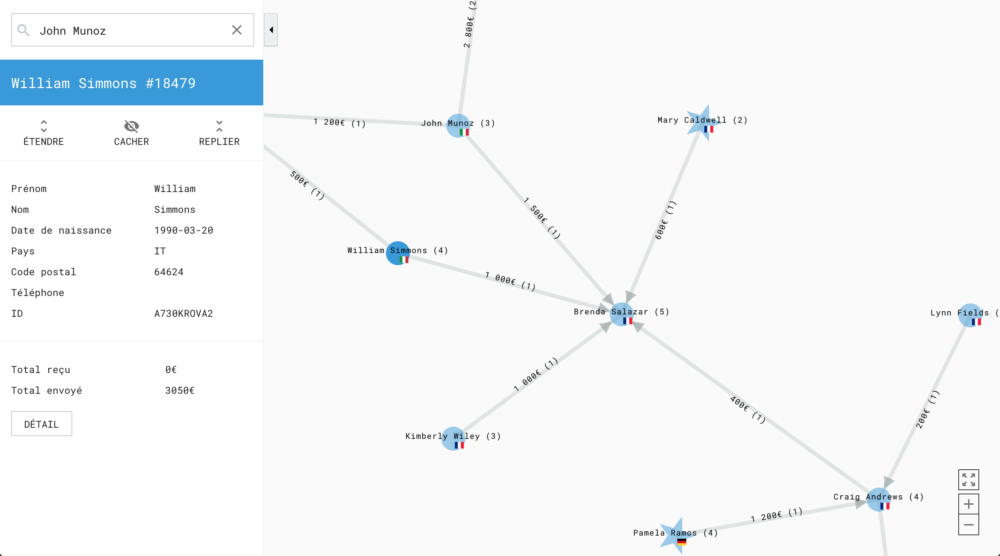
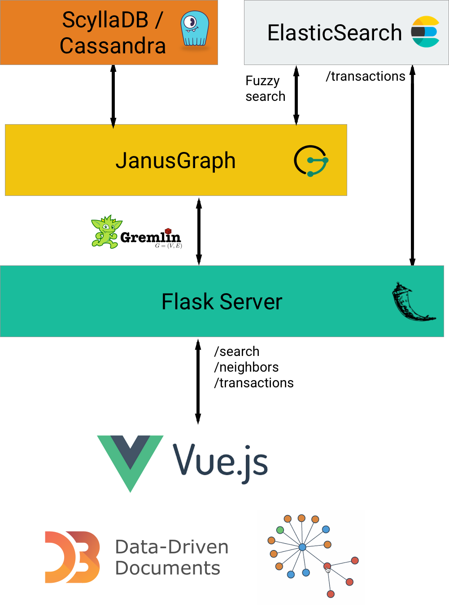

# Graph Explorer
Explore and find suspicious patterns in a large graph of money transactions.



## Architecture 

* JanusGraph 0.2.1 
* ScyllaDB 2.2.0 (storage backend for JanusGraph)
* Elasticsearch 6.0.1 (index backend for JanusGraph)
* Python Flask server
* Vue.js 
* d3.js v4 force layout



## Demo 
Start exploring the graph from any node (e.g with *Amanda Walker*) 
[https://graph-explorer.fr](https://graph-explorer.fr)


## Prerequisites 

* Docker CE >= 1.13.0
* docker-compose >= 1.10.0 

## Installation 
 
Below is a step by step guide explaining how to install the app with sample data. 
If you want to run it with your own data, just replace the following files with your owns:
* `janus/data/nodes.csv`
* `janus/data/links.csv` 
*  `logstash/data/transactions.csv`

Data directories for Elasticsearch and ScyllaDB will be mounted in the `PROJECT_HOME/data`

The different services in the `docker-compose` setup need to be started in a specific order. [`wait-for-it.sh`](https://github.com/vishnubob/wait-for-it) mechanisms (or alike) could be implemented in the future to allow running all the services in a one line command like `docker-compose --build up`.

#### Steps
* Clone the repository
```
> git clone  git@github.com:entrepreneur-interet-general/graph-explorer.git
> cd graph-explorer
``` 
* Download and build Docker images
```
> docker-compose build 
``` 
* Create data directories 
```
mkdir -p data/elasticsearch data/scylla
```
* Start Elasticsearch
```
> docker-compose up -d elasticsearch 
``` 
* Wait for Elasticsearch to be available on port `9200` 
```
> curl localhost:9200/_cat/health 
docker-cluster yellow 1 1 6 6 0 0 6 0 - 50.0%
``` 
* Start ScyllaDB
```
> docker-compose up -d scylladb
``` 
* Wait for ScyllaDB to be available
```
> docker-compose exec scylladb nodetool status
--  Address     Load       Tokens       Owns    Host ID                               Rack
UN  172.22.0.3  1.07 MB    256          ?       c961595a-ee52-4f94-baf3-74cdc5058af6  rack1
``` 
* Start JanusGraph 
```
> docker-compose up -d janus 
``` 
If a previous janus container has not been shut down correctly, you might get the following error: 
```
A JanusGraph graph with the same instance id [*] is already open. Might required forced shutdown.
```
In this case you can run a cleanup script and then restart the `janus` container.
```
> docker-compose run --no-deps janus bin/gremlin.sh -e scripts/clean.groovy
```
*  Wait for JanusGraph to be available on port `8182`
```
> curl -XPOST -d '{"gremlin" : "1+1" }' localhost:8182 
{"result":{"data":[2],"meta":{}}}
```
* Create the graph schema and load nodes and edges into JanusGraph (do it only the first time or after deleting the data directory)  
```
> docker-compose exec janus bin/gremlin.sh -e scripts/create_schema.groovy
> docker-compose exec janus bin/gremlin.sh -e scripts/load_data.groovy 
```
* Checks that nodes and edges have been loaded
```
> curl -XPOST -d '{"gremlin" : "g.V().count()" }' localhost:8182 
{"result":{"data":[1606],"meta":{}}}

> curl -XPOST -d '{"gremlin" : "g.E().count()" }' localhost:8182
{"result":{"data":[2156],"meta":{}}}
```
* Load raw transactions into Elasticsearch (do it only the first time or after deleting the data directoy) 
```
> docker-compose up -d logstash 
```
* Check that transactions have been loaded in the `transactions` index
```
> curl localhost:9200/transactions/doc/_count 
{"count":2156,"_shards":{"total":5,"successful":5,"skipped":0,"failed":0}}
```
* Start the app in the foreground 
```
docker-compose up app 
```
* Visit [http://localhost:5000](http://localhost:5000)

## License

MIT License

Copyright (c) 2018 Entrepreneur.e d’Intérêt Général

Permission is hereby granted, free of charge, to any person obtaining a copy
of this software and associated documentation files (the "Software"), to deal
in the Software without restriction, including without limitation the rights
to use, copy, modify, merge, publish, distribute, sublicense, and/or sell
copies of the Software, and to permit persons to whom the Software is
furnished to do so, subject to the following conditions:

The above copyright notice and this permission notice shall be included in all
copies or substantial portions of the Software.

THE SOFTWARE IS PROVIDED "AS IS", WITHOUT WARRANTY OF ANY KIND, EXPRESS OR
IMPLIED, INCLUDING BUT NOT LIMITED TO THE WARRANTIES OF MERCHANTABILITY,
FITNESS FOR A PARTICULAR PURPOSE AND NONINFRINGEMENT. IN NO EVENT SHALL THE
AUTHORS OR COPYRIGHT HOLDERS BE LIABLE FOR ANY CLAIM, DAMAGES OR OTHER
LIABILITY, WHETHER IN AN ACTION OF CONTRACT, TORT OR OTHERWISE, ARISING FROM,
OUT OF OR IN CONNECTION WITH THE SOFTWARE OR THE USE OR OTHER DEALINGS IN THE
SOFTWARE.
